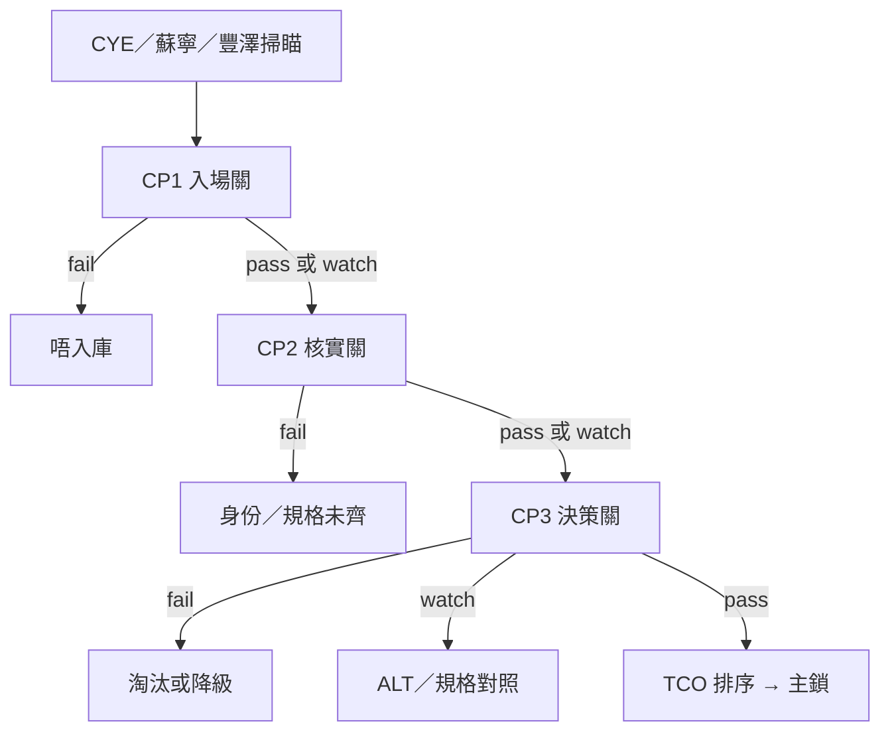

# 洗衣機資料篩選三關

#washer #process #checkpoint

← [[index|洗衣機比較]] · [[compare|總比較表]] · [[2026-09-14-user-decision-ref|決策參照]]

街市列表（CYE／蘇寧／豐澤）唔等於短名單。零售文案會誤標能源級、容量、轉速。呢三關把 **入庫 → 核實 → 決策** 拆開，避免「掃到就當可買」同「規格表最靚就當主鎖」。

規則可跑：`python3 scripts/build_db.py`（寫入 `checkpoint_results`）· `python3 -m unittest scripts.test_checkpoints`。

狀態：`pass` 過關 · `watch` 留案但要標 · `fail` 停。  
**總評** = 三關最差一檔（有 fail 就 fail；否則有 watch 就 watch）。

## CP1 入場關 — 類型／預算／一人用

**目的：** 掃瞄結果未寫進 models 之前，先剷走場景唔啱嘅資料。

| 規則 | pass | watch | fail |
| --- | --- | --- | --- |
| `cp1.form` | 日式上置葉輪 | — | 前置滾筒、熱泵洗乾、迷你單槽 |
| `cp1.price` | 最低街價 ≤ **$2,000** | $2,001–$2,200（J800 鬆預算帶） | > $2,200 或無香港街價 |
| `cp1.capacity` | **6.0–7.5 kg** | 8.0 kg（一人過剩）或 <6.0 kg | **>8.0 kg** |
| `cp1.emsd` | 有 EMSD 編號 | — | 無可核對能源標籤 |

硬門檻對應已鎖定條件：一人用 · ≤ ~$2k · 日式上置。位闊／去水仍未量，**唔放呢關**（安裝係落訂核對，唔係入庫篩選）。

## CP2 核實關 — EMSD 為準

**目的：** 零售頁當線索，唔當規格。容量、能源、年耗電、耗水以 [EMSD Energy Label](https://www.emsd.gov.hk/energylabel/) 為準。

| 規則 | pass | watch | fail |
| --- | --- | --- | --- |
| `cp2.emsd_bound` | 能源／kWh／L／kg 已綁 EMSD | — | 核心規格未綁 |
| `cp2.conflict` | 未見零售 vs EMSD 衝突 | **已用 EMSD 蓋過誤標**（列仍要標黃） | 衝突未解決 |
| `cp2.complete` | 闊、轉速、排水、狀態=`complete` | — | 缺闊／排水／身份未完 |

本庫已捉到嘅誤標（全部 `emsd_wins` → CP2 = watch，唔當規格已信零售）：

| 機 | 零售寫 | EMSD／官方 |
| --- | --- | --- |
| Toshiba Q751 | 蘇寧 6.3kg／715 轉 | 6.5kg／680 轉 |
| Toshiba M731 | 多店 1 級 | **4 級** |
| Midea MJ70 | 部分 1 級 | **2 級** |
| Hitachi LTL 07／08 | 有時 1 級 | **2 級** |

## CP3 決策關 — MTBF／零件／三假設

**目的：** 核實完先排「可唔可以買」，而唔係用轉速表自動升格。對齊 [[2026-09-14-user-decision-ref|用戶決策參照]]。

| 規則 | pass | watch | fail |
| --- | --- | --- | --- |
| `cp3.energy` | 1 級 | 2 級 → ALT | ≥3 級淘汰 |
| `cp3.white_label` | 非白牌 | — | **假設二** 豐澤／雜牌唔入主線 |
| `cp3.belt` | 未標皮帶風險 | **假設三** 惠而浦最多 ALT | — |
| `cp3.brand_premium` | 無「日系貴＝更耐」 | **假設一** 日立只做規格對照 | — |
| `cp3.water` | ≤110 L | >110 L | — |
| `cp3.drain` | 高低一機 | 高排水（要喉位） | 排水不明 |
| `cp3.hardware` | 不銹鋼膽＋阻尼門＋2年／摩打5年 | 未全鎖 | — |
| `cp3.architecture` | 東芝現役 **Q 系** | 其他品牌／舊線 | — |

三關全過先入主鎖排序；其餘 watch 做 ALT，fail 做 demote／drop。現庫只有 **Q801** 全綠 — 同 PRIMARY 一致。Q751 規格過 CP3，但蘇寧誤標令 CP2 留 watch（買 CYE、唔抄蘇寧標題）。

## 現庫結果（2026-09-14）

| 機 | 低價 | CP1 | CP2 | CP3 | 總評 | 一句 |
| --- | --- | --- | --- | --- | --- | --- |
| [[models/toshiba-aw-q801aph\|Q801]] | $1,880 | pass | pass | pass | **pass** | 三關全過 · 主鎖 |
| [[models/toshiba-aw-q751aph\|Q751]] | $1,799 | pass | watch | pass | watch | 蘇寧容量／轉速誤標 |
| [[models/hitachi-ltl065sm00\|065]] | $1,800 | pass | pass | watch | watch | 假設一 · 規格對照 |
| [[models/whirlpool-vemc65811\|VEMC]] | $1,880 | pass | pass | watch | watch | 假設三 |
| [[models/sharp-es-hk750x-w\|Sharp750]] | $1,980 | pass | pass | watch | watch | 耗水 120 L |
| [[models/midea-mj70n68p\|MJ70]] | $1,798 | pass | watch | watch | watch | 誤標＋2 級 |
| [[models/hitachi-ltl07sm00\|LTL07]] | $1,920 | pass | watch | watch | watch | 誤標＋2 級 |
| [[models/hitachi-ltl08sm00\|LTL08]] | $2,080 | watch | watch | watch | watch | 稍超 $2k＋8 kg |
| [[models/fortress-fjw75m25\|FJW75]] | $1,780 | pass | pass | fail | **fail** | 假設二白牌 |
| [[models/toshiba-aw-m731aph\|M731]] | $1,780 | pass | watch | fail | **fail** | EMSD 4 級 |
| [[models/fortress-fjw85m25\|FJW85]] | $2,200 | fail | fail | fail | **fail** | 8.5 kg＋資料未齊 |

新機流程：掃瞄 → CP1 → 建 `models/*.md` → 對 EMSD（CP2）→ 先跑三關再改 `shortlist`。模板見 [[_model-template]]。
